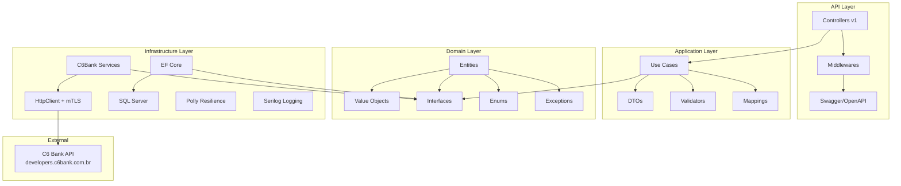

# Arquitetura — C6 Bank Integration API

## Visão Geral

Este projeto segue os princípios da **Clean Architecture** de Robert C. Martin, com separação clara de responsabilidades entre as camadas.

## Diagrama de Camadas



## Dependências entre Camadas

```
API → Application → Domain ← Infrastructure
```

- **Domain**: sem dependências externas (puro C#)
- **Application**: depende apenas do Domain
- **Infrastructure**: depende do Domain (implementa interfaces)
- **API**: depende de Application + Infrastructure (DI)

## Componentes Principais

### Domain Layer
- **Entities**: `Boleto`, `PixCharge`, `Webhook` (herdam de `BaseEntity`)
- **Value Objects**: `Money`, `Cpf`, `Cnpj`, `Document` (imutáveis, auto-validados)
- **Interfaces**: contratos para repositórios e serviços externos
- **Exceptions**: `DomainException`, `BusinessRuleException`, `InvalidDocumentException`

### Application Layer
- **Use Cases**: um caso de uso por operação (`CreateBoletoUseCase`, etc.)
- **DTOs**: records imutáveis separados em Request/Response
- **Validators**: FluentValidation com regras de negócio
- **Mappings**: AutoMapper profiles

### Infrastructure Layer
- **C6BankHttpClient**: cliente HTTP tipado com OAuth2, mTLS e headers padrão
- **C6BankAuthService**: gerencia token OAuth2 com cache (IMemoryCache)
- **Repositories**: EF Core com SQL Server
- **PollyPolicies**: Retry (exponential backoff), Circuit Breaker, Timeout

### API Layer
- **Controllers**: versionados (`/api/v1/`), documentados com XML comments
- **Middlewares**: CorrelationId, RequestLogging, GlobalExceptionHandler
- **Swagger**: documentação completa com exemplos e autenticação Bearer

## Padrões Aplicados

| Padrão | Onde |
|--------|------|
| Clean Architecture | Estrutura geral |
| Domain-Driven Design | Value Objects, Entities, Exceptions |
| Repository Pattern | Repositórios EF Core |
| Use Case Pattern | Camada Application |
| Factory Method | `Boleto.Create()`, `PixCharge.CreateImmediate()` |
| Options Pattern | `C6BankSettings` |
| Decorator | Polly wrapping HttpClient |
